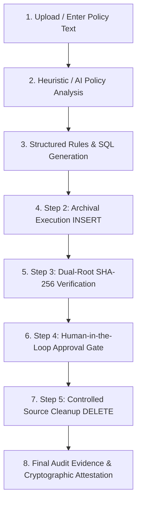

# Agentic Control Automation Platform

> **Autonomous, Audit-Ready Compliance Control Automation & Cryptographic Ledger**  
> *Archive first. Verify. Then obtain human approval before source cleanup.*

---

## 📌 Overview

The **Agentic Control Automation Platform** is an enterprise-grade compliance automation system designed to bridge the gap between unstructured regulatory policy documents and verified, auditable execution across cloud databases and enterprise infrastructure.

It autonomously ingests compliance policies, translates retention and security mandates into structured, executable rules, executes live database operations with dual-root SHA-256 Merkle tree verification, and enforces zero-trust human-in-the-loop approval gates before any destructive actions take place.

---

## 🚀 Key Features

- **📜 Heuristic & AI Policy Extraction:** Ingest raw regulatory policy texts (e.g., PCI-DSS, SOX, GDPR, ISO 27001) and extract machine-actionable conditions, operational constraints, and retention periods without external hallucination.
- **🛡️ 5 Core Control Archetypes:**
  - **Archetype A (`CTL-VULN-001`)**: Database Vulnerability Management & Patch Review.
  - **Archetype B (`CTL-SAN-001`)**: Post-Change Sanity Testing & Synthetic Transaction Health Checks.
  - **Archetype C (`CTL-PRIV-001`)**: Privileged Access Review & Separation of Duties (SoD) Verification.
  - **Archetype D (`CTL-ARCH-001`)**: Data Archival Compliance with Cryptographic Verification.
  - **Archetype E**: Custom Dynamic Policy-to-Code Controls.
- **🔐 Immutable Audit Ledger & Merkle Verification:**
  - Cryptographically chained run evidence logs with SHA-256 hashing.
  - Dual-root Merkle verification ensuring exact record-level integrity across source and archive databases before purge authorization.
  - Inbuilt tamper detection and forensic reconciliation.
- **👤 Zero-Trust Human Approval Gates:**
  - Controlled source data cleanup is strictly locked until explicit digital authorization is granted by an authorized compliance analyst or CISO.
- **💻 Interactive Control Studio (Web Console):**
  - Full-lifecycle visual console: Policy Upload $\to$ AI Analysis $\to$ Structured Rules $\to$ Archival Execution $\to$ Dual-Root Verification $\to$ Human Approval $\to$ Source Cleanup $\to$ Audit Evidence.
  - Live inspection of `source_transactions` and `archive_transactions` with real-time record reconciliation.
  - Production-ready dark SQL syntax viewer with copy-to-clipboard functionality.

---

## 🏗️ Architecture & Project Structure

```
CONTROLS_AUTO/
├── agents/                 # Autonomous agent templates & LLM-assisted workflows
├── api/                    # FastAPI backend service
│   ├── main.py             # API entrypoint & middleware configuration
│   ├── routers/            # Modular route controllers
│   │   ├── controls.py     # Control library & execution endpoints
│   │   ├── interactive.py  # Interactive Studio (policy parse, SQL preview, verify, approve, cleanup)
│   │   ├── audit.py        # Cryptographic ledger & audit evidence export
│   │   └── auth.py         # RBAC session & user context
│   └── sse.py              # Real-time Server-Sent Events stream manager
├── catalogs/               # Seed control definitions, metadata & schemas
├── contracts/              # Pydantic data transfer schemas & API contracts
├── controls/               # Core control engine & evaluation handlers
├── core/                   # Cryptographic ledger, Merkle trees & security primitives
│   ├── ledger.py           # Tamper-evident hash-chained audit ledger
│   └── merkle.py           # Merkle tree implementation & dual-root reconciliation
├── sim/                    # Real SQLite database engine & seed simulation
│   └── database.py         # Live active/archive tables, data generator, and purge executor
├── tests/                  # Pytest test suite (architecture, RBAC, ledger, connectors)
├── evals/                  # Comprehensive archetype evaluation test suite
└── web/                    # Modern React + TypeScript + Tailwind CSS web console
    ├── src/
    │   ├── api/client.ts   # Typed API client for FastAPI backend
    │   ├── components/     # UI components (badges, status tags, hash viewers)
    │   └── features/       # Feature modules:
    │       └── library/    # Control Library & Interactive ControlExecutionModal
    └── package.json        # Frontend dependencies & build scripts
```

---

## ⚡ Quick Start Guide

### 1. Prerequisites
- **Python**: `>= 3.12`
- **uv**: Package and virtual environment manager (`curl -LsSf https://astral.sh/uv/install.sh | sh` or `pip install uv`)
- **Node.js**: `>= 18.x` and **npm**

---

### 2. Backend Setup & Startup

From the project root:

```bash
# 1. Install Python dependencies
uv sync

# 2. Start the FastAPI backend server (port 8000)
uv run uvicorn api.main:app --port 8000 --reload
```

The API documentation is accessible at:
- **Swagger UI**: [http://localhost:8000/docs](http://localhost:8000/docs)
- **OpenAPI JSON**: [http://localhost:8000/openapi.json](http://localhost:8000/openapi.json)

---

### 3. Frontend Setup & Startup

From a separate terminal:

```bash
# 1. Navigate to the web directory
cd web

# 2. Install dependencies
npm install

# 3. Launch the Vite development server (port 5173)
npm run dev
```

The web console will be accessible at:
- **Web App**: [http://localhost:5173](http://localhost:5173)

---

## 🧪 Testing & Code Quality

Run the comprehensive test suite (47+ tests across unit, integration, and archetype evaluations):

```bash
# Run pytest test suite
uv run pytest

# Check code formatting & linting
uv run ruff check .

# Check static typing
uv run mypy .

# Test frontend build
cd web && npm run build
```

---

## 🔄 End-to-End Control Lifecycle (Walkthrough)

The platform implements an **Archive-First, Verify-Before-Delete** pipeline:



1. **Policy Upload & Ingestion**: Enter or upload raw compliance policies (e.g. *Transaction Data Archival Policy*).
2. **Policy Analysis**: Extracts retention thresholds (e.g., `transaction_date > 5 years`), exceptions, and ambiguity flags.
3. **Structured SQL Preview**: Generates compliant dialect queries (`SELECT` selection, `INSERT` copy, `DELETE` purge).
4. **Archival Execution (`INSERT`)**: Safely copies eligible records into `archive_transactions` with record-level cryptographic hashes without touching source data.
5. **Dual-Root Cryptographic Verification**: Calculates and cross-compares Merkle root hashes of active vs. archived datasets.
6. **Human Approval Gate**: Requires authorized user sign-off (`Sushanth - Compliance Analyst`) before unlocking source purge.
7. **Source Cleanup (`DELETE`)**: Safely purges only the verified eligible records from `source_transactions`.
8. **Audit Evidence**: Emits an immutable, signed ledger entry recording timestamps, actor identities, SQL executions, and Merkle root attestations.

---

## 👥 Role-Based Access Control (RBAC)

The platform enforces strict role-based authorization across all execution and ledger endpoints:

| Role | Permissions |
| :--- | :--- |
| `AUDITOR` | View control definitions, inspect audit evidence, and verify ledger Merkle proofs (Read-only). |
| `COMPLIANCE_ANALYST` | Ingest policies, execute staging control runs, run archival SQL, and submit review packages. |
| `CISO` | Authorize destructive cleanup gates, override policy ambiguities, and sign compliance attestations. |
| `SYSTEM_ADMIN` | Manage database connectors, reseed simulation environments, and maintain system health. |

---

## 📄 License

This project is licensed under the MIT License. See [LICENSE](LICENSE) for details.
