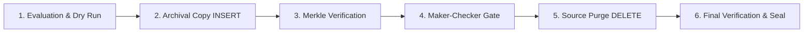

# Agentic Control Automation Platform

An enterprise compliance automation platform that translates regulatory policies into verifiable, executable controls across distributed database environments, backed by cryptographic Merkle verification and an immutable append-only ledger.

---

## Table of Contents

1. [Overview](#overview)
2. [Core Principles](#core-principles)
3. [Control Archetypes](#control-archetypes)
4. [Six-Step Control Execution Lifecycle](#six-step-control-execution-lifecycle)
5. [Architecture & Project Structure](#architecture--project-structure)
6. [Multi-Agent System & Intelligence Engine](#multi-agent-system--intelligence-engine)
7. [Cryptographic Verification & Ledger](#cryptographic-verification--ledger)
8. [Database Engine & Simulation Schema](#database-engine--simulation-schema)
9. [Role-Based Access Control (RBAC)](#role-based-access-control-rbac)
10. [Quick Start Guide](#quick-start-guide)
11. [Testing & Verification](#testing--verification)
12. [Environment Configuration](#environment-configuration)
13. [License](#license)

---

## Overview

The Agentic Control Automation Platform bridges the gap between unstructured compliance and legal mandates (such as SOX Section 404/802, GDPR Article 5(1)(e), PCI-DSS, and ISO 27001) and operational execution across enterprise infrastructure.

Traditional compliance relies on manual periodic audits, disconnected ticketing systems, and unverified batch scripts that introduce human error and spoliation risks. This platform provides:

- Automated policy extraction from documents (PDF, DOCX, TXT, Markdown).
- Deterministic SQL translation with strict parameter bounds.
- Dual-root SHA-256 Merkle tree verification between source and destination systems before any source modification.
- Zero-trust maker-checker authorization gates enforcing segregation of duties.
- Cryptographically chained audit ledgers producing non-repudiable audit certificates.

---

## Core Principles

1. **Archive First, Verify, Then Purge:** Source records are never altered or deleted until they are copied to compliant secondary storage and cryptographically reconciled.
2. **Deterministic Guardrails:** AI and LLMs interpret policies and propose execution plans; deterministic parsers and AST validation enforce the actual query bounds.
3. **Non-Repudiation:** Every action, decision, approval, and record hash is anchored into an immutable, SHA-256 hash-chained ledger.
4. **Dual Authorization (Maker-Checker):** Destructive actions require digital authorization by an independent reviewer role before locks are released.
5. **Zero Data Spoliation:** Active litigation holds, unresolved fraud inquiries, and active regulatory investigations permanently override standard retention deletions.

---

## Control Archetypes

The platform is organized around 5 core control archetypes designed to scale across thousands of enterprise controls:

| Archetype | Identifier | Description | Target Systems |
| :--- | :--- | :--- | :--- |
| **Archetype A** | `CTL-VULN-001` | Database Vulnerability Management & Patch SLA Review | `database_users`, `system_config` |
| **Archetype B** | `CTL-SAN-001` | Change Management & Release Sanity Regression Verification | Critical service routes, APIs |
| **Archetype C** | `CTL-PRIV-001` | Privileged Access & Separation of Duties (SoD) Review | Access logs, superuser roles |
| **Archetype D** | `CTL-ARCH-001` | Transaction Data Archival & Controlled Purge Compliance | `source_transactions`, `archive_transactions` |
| **Archetype E** | Generic Review | Document Review & Policy-to-Code Synthesis | Ingested PDF / DOCX contracts |

---

## Six-Step Control Execution Lifecycle

For Archetype D (Execute & Verify Archival Control), execution follows a strict 6-stage lifecycle:



### Step 1: Policy Ingestion & Candidate Selection
- Analyzes policy rules, retention thresholds (e.g. 5-year cutoff), and exclusion criteria.
- Executes safe `SELECT` queries across primary storage (`source_transactions`).
- Partitions datasets into eligible records (33), statutory legal holds (3), and retained active records (18).

### Step 2: Archival Execution (INSERT)
- Executes an atomic `INSERT OR REPLACE INTO archive_transactions` preserving full column fidelity, foreign-key relationships, and timestamp metadata.
- Leaves source data completely untouched.

### Step 3: Dual-Root SHA-256 Merkle Verification
- Computes canonical SHA-256 row hashes across both source and archive datasets.
- Builds binary Merkle trees for both tables.
- Asserts `MerkleRoot(source_eligible) == MerkleRoot(archive_inserted)`. If even one byte differs, the workflow aborts.
- Emits an authenticated cryptographic attestation token (`ATTEST-RUN-...`).

### Step 4: Maker-Checker Dual-Authorization Gate
- Enforces segregation of duties. An independent Compliance Reviewer inspects volume statistics, Merkle reconciliation results, and proposed cleanup SQL.
- Reviewer signs off digitally with operator comments, issuing an approval certificate (`APPR-GATE-...`).

### Step 5: Controlled Source Cleanup (DELETE)
- Executes targeted `DELETE FROM source_transactions` strictly scoped to verified, archived record IDs.
- Re-verifies legal hold flags immediately prior to execution to prevent accidental race condition purges.

### Step 6: Final Verification & Immutable Ledger Sealing
- Reconciles remaining source counts against destination archive counts.
- Appends a `final_signoff` block to the cryptographic ledger.
- Issues an official Audit Certificate (`AUD-CERT-...`) anchored to the ledger sequence number and parent block hash.
- Sets run status to `COMPLETED` and seals records into read-only audit state.

---

## Architecture & Project Structure

```
CONTROLS_AUTO/
├── agents/                 # Specialized LangGraph multi-agent modules
│   ├── challenger.py       # Adversarial critic agent challenging proposed findings
│   ├── evaluator.py        # Contextual CVE & policy exception evaluator
│   ├── impact_analyst.py   # API change & dependency impact analyzer
│   ├── interpreter.py      # Dual-model policy document interpreter
│   ├── onboarder.py        # Spreadsheet RCM to YAML control definition onboarder
│   ├── planner.py          # Data volume anomaly & execution plan reviewer
│   ├── reporter.py         # Audit workpaper generator citing cryptographic evidence
│   └── templates/          # Versioned agent prompt contracts
├── api/                    # FastAPI backend service
│   ├── main.py             # Application entrypoint & middleware configuration
│   ├── rbac.py             # Role-based authorization & header-based principal resolver
│   ├── sse.py              # Server-Sent Events broker for real-time telemetry
│   └── routers/            # Route controllers
│       ├── controls.py     # Control library catalog & schema endpoints
│       ├── interactive.py  # Interactive execution, preview, approval, and document streaming
│       ├── runs.py         # Run telemetry, evidence packages, and audit bundles
│       ├── vulnerability.py# Vulnerability control evaluation endpoints
│       └── auth.py         # Current user session & permissions
├── catalogs/               # Seed YAML control definitions (CTL-ARCH-001, CTL-VULN-001, etc.)
├── contracts/              # Pydantic schemas (PolicyIR, ControlDefinition, Evidence, Ledger)
├── controls/               # Core execution handlers and rule evaluators
├── core/                   # Security, cryptography, and extraction engines
│   ├── citations.py        # Verbatim text quote validator & reconciliation engine
│   ├── cloudinary_client.py# Cloudinary asset storage client with local streaming fallback
│   ├── document_extractor.py# Multi-format document parser (PDF, DOCX, TXT, Markdown)
│   ├── hashing.py          # Canonical row atom normalizer and SHA-256 hasher
│   ├── ledger.py           # Hash-chained append-only evidence ledger
│   ├── llm.py              # LiteLLM client with schema retry and role abstraction
│   ├── merkle.py           # Merkle tree constructor & binary-search break detector
│   ├── policy_parser.py    # Deterministic compliance rule, SLA, and AST parser
│   └── posthooks.py        # Ledger and citation verification post-hooks
├── infra/                  # Infrastructure configurations
│   ├── compose.yaml        # Docker Compose deployment (Postgres, OPA, LiteLLM)
│   └── opa/                # Open Policy Agent Rego definitions
├── sim/                    # Real SQLite database engine & audit store
│   ├── audit_store.py      # SQLite persistence for runs, steps, findings, evidence, and approvals
│   ├── database.py         # Bank core & archive tables, seed generators, and purge logic
│   └── schema.sql          # Primary relational schema definitions
├── tests/                  # Pytest test suite (architecture, RBAC, Merkle, persistence, LLM)
├── evals/                  # Control archetype evaluation suites (Archetypes A through E)
├── tools/                  # Connectors and tool gateway
│   ├── gateway.py          # Embedded OPA policy authorization gateway
│   └── connectors/         # Database, evidence, and notification connectors
├── web/                    # Modern React 18 + TypeScript + Tailwind CSS web console
│   ├── src/
│   │   ├── api/client.ts   # Strongly typed API client
│   │   ├── features/       # Feature modules:
│   │   │   ├── dashboard/  # Live analytics, posture, and execution telemetry
│   │   │   ├── library/    # Control Library & ControlExecutionModal
│   │   │   ├── runs/       # Runs Explorer, audit packages, and resume viewer
│   │   │   ├── findings/   # Security and compliance findings management
│   │   │   └── approvals/  # Maker-checker dual-authorization review queue
│   │   └── types/          # Frontend domain models and DTO interfaces
│   └── package.json
├── pyproject.toml          # Python project specification (uv / pip)
└── requirements.txt        # Pinned Python dependencies
```

---

## Multi-Agent System & Intelligence Engine

The platform incorporates specialized, role-based agents defined in `agents/`. Agents decouple model vendor specifics by requesting roles (`reasoner`, `fast`, `critic`) mapped in `core/llm.py`:

- **InterpreterAgent (`agents/interpreter.py`):** Operates in dual-extraction mode (`reasoner` vs `fast`) to extract `PolicyIR` with exact text citations.
- **PlannerAgent (`agents/planner.py`):** Reviews deterministic execution plans against historic volume baselines and foreign-key dependency orders.
- **EvaluatorAgent (`agents/evaluator.py`):** Evaluates contextual rule violations (e.g. verifying whether a CVE affects an active database version).
- **ChallengerAgent (`agents/challenger.py`):** Runs on an independent model family as an adversarial critic to challenge findings before signoff.
- **ImpactAnalystAgent (`agents/impact_analyst.py`):** Assesses release diffs and dependency graphs to identify downstream test surfaces.
- **ReporterAgent (`agents/reporter.py`):** Drafts formal compliance workpapers where every section cites verified evidence IDs.
- **OnboarderAgent (`agents/onboarder.py`):** Converts Risk and Control Matrix (RCM) spreadsheet rows into executable YAML controls.

*Note on Local Resilience:* For local development and instant UI feedback, `core/policy_parser.py` provides deterministic regex and AST parsing that executes in under 20ms without external API dependencies.

---

## Cryptographic Verification & Ledger

### Canonical Hashing Specification
To prevent database formatting inconsistencies (e.g. timestamp representations, spacing, numeric scale) from causing false verification failures, `core/hashing.py` converts each row into canonical atoms:
- Null: `"N"`
- Value: `"V" + byte_length + ":" + normalized_value`
- Row Hash: `SHA256(atom_1 || atom_2 || ... || atom_n)`

### Merkle Tree Verification
`core/merkle.py` constructs a deterministic binary tree:
- Leaves: `SHA256(0x00 || len(PK) || PK || RowHash)` sorted strictly by primary key.
- Parents: `SHA256(0x01 || LeftChild || RightChild)`.
- If an odd node occurs at any level, it is promoted directly to the next level.
- Fast break detection: `bisect_breaks()` locates mismatched or missing rows in $O(\log N)$ time.

### Append-Only Hash-Chained Ledger
`core/ledger.py` ensures non-repudiation:
$$\text{entry\_hash} = \text{SHA-256}(\text{prev\_hash} \,\|\, \text{payload\_sha256} \,\|\, \text{timestamp} \,\|\, \text{actor})$$
- Monotonically increasing sequence numbers (`SEQ #1`, `SEQ #2`).
- The `verify_chain()` method continuously checks chain integrity from the genesis block (`00000000...`), detecting any historical tampering immediately.

---

## Database Engine & Simulation Schema

The platform maintains realistic relational banking schemas across two SQLite database files:

### Production Core Database (`bank_core.db`)
- `source_transactions`: Primary transaction ledger with attributes:
  - `transaction_id` (Primary Key)
  - `account_id` (Foreign Key referencing `accounts`)
  - `customer_name`
  - `transaction_date`
  - `amount`
  - `transaction_type` (`WIRE`, `ACH`, `CHECK`)
  - `legal_hold` (0 or 1)
  - `support_ticket_id`
  - `investigation_status` (`NONE`, `ACTIVE`, `RESOLVED`)
  - `document_ref`
- `customers` & `accounts`: Relational reference entities.
- `database_users` & `system_config`: Configuration entities for Archetypes A and C.

### Archive Database (`bank_archive.db`)
- `archive_transactions`: Write-restricted destination preserving all source attributes alongside:
  - `control_run_id`: Traceability back to the execution run.
  - `verification_hash`: Cryptographic leaf hash verified during migration.
  - `archived_at`: UTC timestamp of archival insertion.

### Audit Store (`sim/audit_store.py`)
Persists all audit entities across runs:
- `control_audit_runs`: Master run records, evaluated counts, and Merkle roots.
- `control_audit_steps`: Lifecycle step checkpoints (`PREVIEW`, `COPY_TO_ARCHIVE`, `MERKLE_VERIFY`, `HUMAN_APPROVAL`, `SOURCE_PURGE`, `FINAL_VERIFICATION`).
- `control_evidence`: Tamper-evident evidence artifacts.
- `control_approvals`: Dual-authorization gate records.
- `compliance_policy_documents`: Ingested policy files, text content, and hashes.

---

## Role-Based Access Control (RBAC)

Authorization is enforced at both API gateway and UI levels (`api/rbac.py`):

| Role | Permitted Actions |
| :--- | :--- |
| `auditor` | Read-only inspection of definitions, runs, Merkle proofs, evidence bundles, and ledger integrity. |
| `control_owner` | Ingest policies, configure control definitions, run dry-run evaluations, and execute non-destructive staging steps. |
| `control_reviewer` | Authorize maker-checker approval gates, review volume anomalies, and approve source purge execution. |
| `admin` | Reseed databases, configure model routing, manage connectors, and administer system health. |

---

## Quick Start Guide

### Prerequisites
- Python >= 3.12
- `uv` (Fast Python package manager): `curl -LsSf https://astral.sh/uv/install.sh | sh` or `pip install uv`
- Node.js >= 18.x and `npm`

### 1. Backend Service Setup

```bash
# 1. Install dependencies into virtual environment
uv sync

# 2. Launch FastAPI backend on port 8000
uv run uvicorn api.main:app --port 8000 --reload
```

Backend endpoints:
- API Root: `http://localhost:8000`
- Swagger Interactive Documentation: `http://localhost:8000/docs`
- OpenAPI Specification: `http://localhost:8000/openapi.json`

### 2. Frontend Web Console Setup

From a separate terminal:

```bash
# 1. Navigate to the web directory
cd web

# 2. Install Node dependencies
npm install

# 3. Start Vite development server on port 5173
npm run dev
```

Frontend application:
- Web Console: `http://localhost:5173`

---

## Testing & Verification

The repository maintains an extensive test suite covering unit tests, cryptographic Merkle verification, ledger tamper detection, and archetype evaluations:

```bash
# Run all 90 backend tests
uv run pytest

# Run specific audit persistence tests
uv run pytest tests/test_audit_persistence.py

# Run archetype evaluation suites
uv run pytest evals/

# Verify code formatting and linting
uv run ruff check .

# Verify static typing
uv run mypy .

# Compile and build the frontend bundle
cd web && npm run build
```

---

## Environment Configuration

Copy `.env.example` to `.env` to configure optional integrations:

```bash
cp .env.example .env
```

Key environment variables:

| Variable | Default | Purpose |
| :--- | :--- | :--- |
| `DATABASE_URL` | `sqlite:///sim/bank_core.db` | Primary database connection string |
| `ARCHIVE_DATABASE_URL` | `sqlite:///sim/bank_archive.db` | Archive database connection string |
| `LITELLM_API_BASE` | `http://localhost:4000` | LiteLLM proxy endpoint for LLM agents |
| `OPA_URL` | `http://localhost:8181` | Open Policy Agent daemon endpoint |
| `CLOUDINARY_CLOUD_NAME` | *(Optional)* | Cloud storage for policy documents (falls back to local streaming) |
| `CLOUDINARY_API_KEY` | *(Optional)* | Cloudinary API Key |
| `CLOUDINARY_API_SECRET` | *(Optional)* | Cloudinary API Secret |

---

## License

This project is licensed under the MIT License. See [LICENSE](LICENSE) for details.
